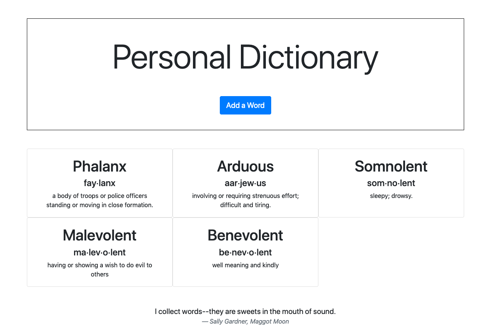

# Personal Dictionary

A web-based word list to track new words, how they are pronounced, and give them simple definitions.

# Motivation 

I am dyslexic and I read by sight-word recognition. This causes reading to be very difficult especially when there 
are lot of words that I may not have seen written down before. In a Psychoeducational Assessment Report, from when
I first started university, there was a recommendation that I create a dictionary of new words.

> Julie Anne is encouraged to start a dictionary of new words. Whenever she encounters a word that she does not know 
she should add it to this dictionary. She should then develop a definition of this word and use it repeatedly until 
it has been mastered. Once the word is mastered it can be removed from the dictionary as it will now be part of her 
regular vocabulary.

Over the years I have looked for an approach or software that would help me achieve this goal, to no success. Now 
with my software development skills, I thought this would be a fun coding project that is more useful then trying to create
 a blog platform or todo app.

# Screenshot

# Tech Stack
 - MongoDB Atlast
 - Python
 - Tornado
 - Bootstrap
 

